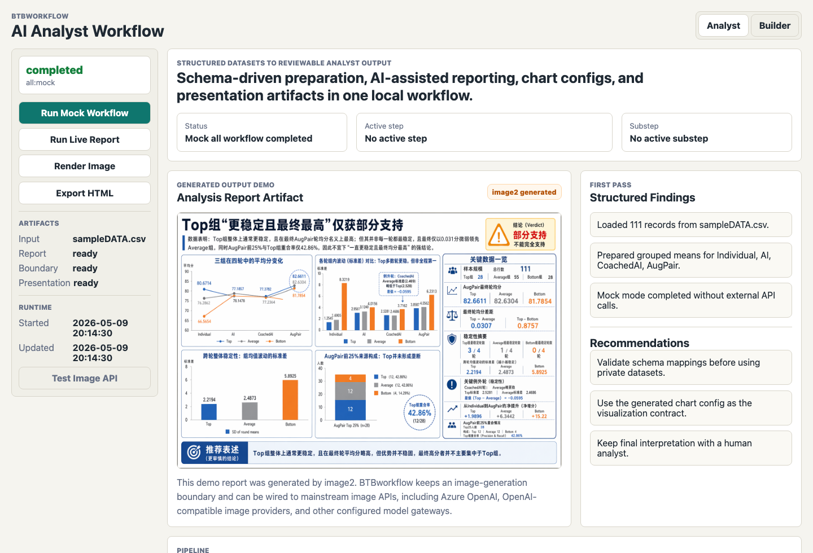
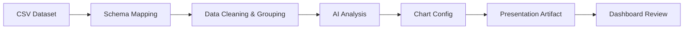
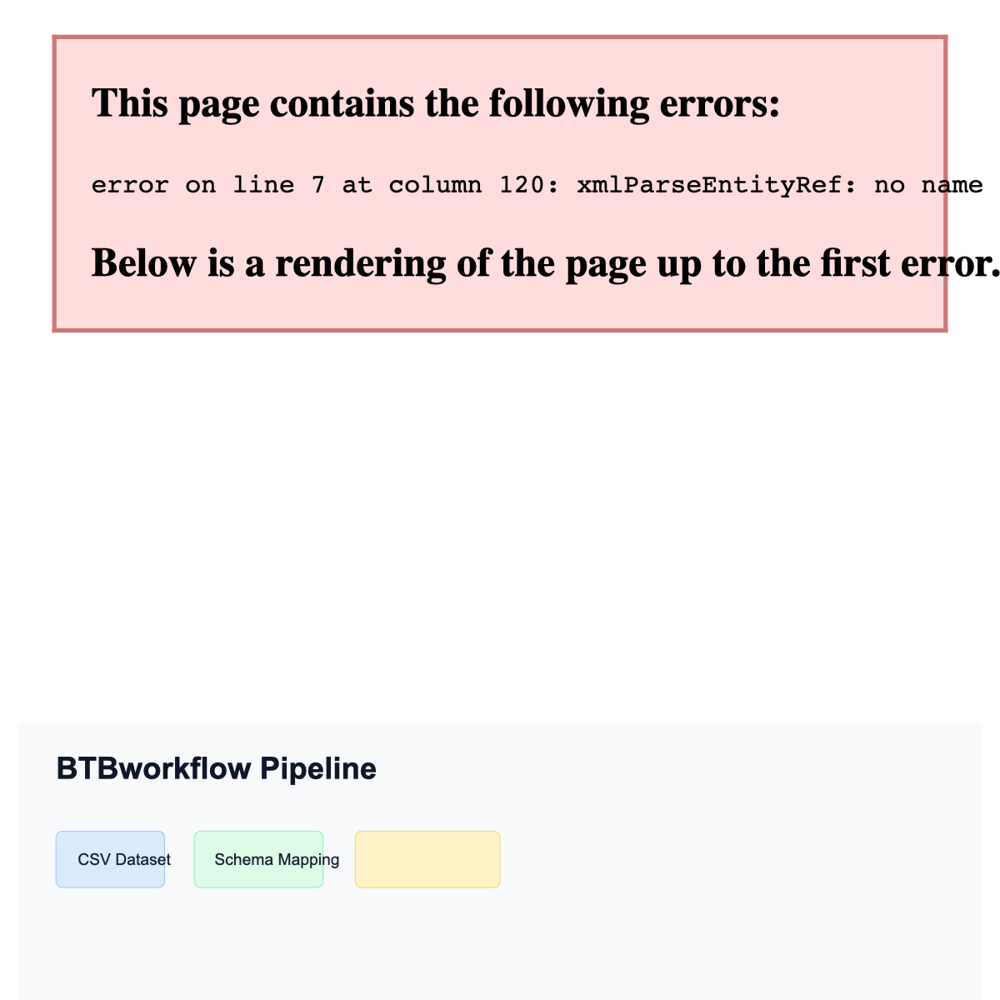
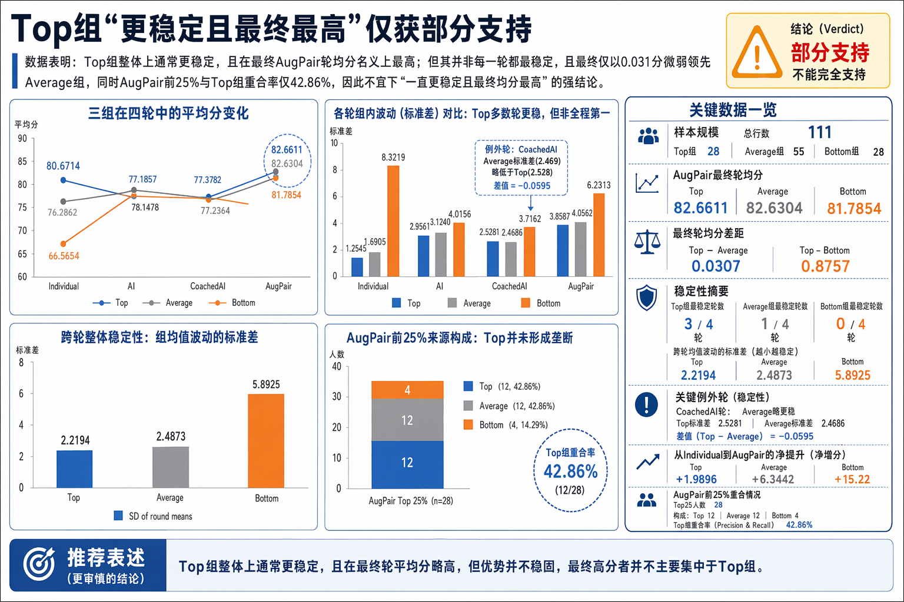

# BTBworkflow

BTBworkflow is an independent Python-based AI workflow prototype for analyst
productivity. It demonstrates how structured datasets can be transformed into
analysis reports, chart configs, and presentation-ready artifacts.

Built for analyst productivity use cases such as investment research, business performance review, customer segmentation, and internal reporting automation.



## Context for Reviewers

BTBworkflow is an independent side project built as a public, inspectable
example of my AI workflow and analyst-productivity thinking. It is not an
enterprise production system. My larger professional AI workflow work has
focused on B2B enterprise review products for large multinational retail / chain
enterprises, but that work cannot be fully disclosed or publicly demonstrated
due to confidentiality and compliance constraints.

This repository is intended to provide a concrete, runnable example of the same
product mindset at a smaller scale: identify a repeated workflow pain point,
standardize the input, use AI to generate structured first-pass outputs, and
leave final interpretation to human reviewers.

## How This Relates To My Broader AI Work

My broader AI work focuses on turning AI from a chat interface into structured
business workflows. In enterprise settings, this means designing systems with
event intake, task routing, knowledge grounding, human review, approval gates,
audit trails, and clear governance boundaries.

This repository is a smaller public example of that same approach. It is
intentionally limited in scope so that reviewers can inspect the logic, run the
demo, and understand the workflow without access to private enterprise
materials.

## What It Is

`BTBworkflow` is a Python-based AI analyst workflow prototype that demonstrates how a structured CSV can become a reusable analysis package:

1. Load a CSV dataset.
2. Apply schema-driven data preparation.
3. Clean, rank, and group records.
4. Generate a structured analysis report and chart config.
5. Convert the report into a presentation-style artifact for review in a lightweight local dashboard.

It is designed for portfolio demos, recruiter review, and lightweight analyst
productivity experiments. It is a prototype, not a finished SaaS product.

## Who It Is For

- Analysts who repeatedly clean structured datasets and prepare first-pass reports.
- Product and data teams exploring internal reporting automation.
- Hiring managers reviewing an applied AI workflow demo.
- Developers who want a compact Python MVP before exploring a fuller web
  product architecture.

## Why This Matters For Analysts

Analysts repeatedly spend time cleaning structured datasets, segmenting records, generating first-pass insights, preparing report drafts, and creating presentation-ready outputs. BTBworkflow automates that repetitive first-pass workflow while leaving final interpretation, judgment, and communication to human analysts.

For investment research, business performance review, customer segmentation, and internal reporting, the goal is not to replace the analyst. The goal is to turn clean inputs into a reviewable draft faster, with chart-ready outputs that can be inspected instead of manually reconstructed.

## Workflow





## Quick Start: Mock Mode

Mock mode runs the full demo without `.env`, API keys, live model endpoints, or network calls.

```bash
python -m venv .venv
source .venv/bin/activate
pip install -r requirements.txt

python run_workflow.py --stage report --mock
python run_workflow.py --stage image --mock
python run_workflow.py --stage all --mock
python webapp.py
```

Open [http://127.0.0.1:8000](http://127.0.0.1:8000) after starting the dashboard.

Mock mode writes:

- `final_output.json`
- `chart_config.json`
- `image_soft_boundary.json`
- `mock_presentation.html`
- `workflow_state.json`

These are runtime artifacts and are ignored by Git.

## Quick Start: Live API Mode

Live mode uses the same workflow structure but calls configured model APIs.

```bash
cp .env.example .env
# Fill .env with your own local credentials only.

python run_workflow.py --stage report
python run_workflow.py --stage image
python run_workflow.py --stage all
python webapp.py
```

Required live environment variables:

- `TEXT_MODEL_ENDPOINT`
- `TEXT_MODEL_API_KEY`
- `TEXT_MODEL_API_VERSION`
- `TEXT_MODEL_DEPLOYMENT`
- `IMAGE_MODEL_ENDPOINT`
- `IMAGE_MODEL_API_KEY`
- `IMAGE_MODEL_API_VERSION`
- `IMAGE_MODEL_DEPLOYMENT`

Never commit `.env` or real credential values.

## CLI

```bash
python run_workflow.py --help
```

Supported stages:

- `--stage report` prepares the dataset, creates a structured report, chart config, and image boundary.
- `--stage image` creates the presentation artifact from the latest report.
- `--stage all` runs report and image stages together.
- `--mock` runs deterministically from local sample data without external API calls.

## Example Input And Output

Safe publishable examples are in `examples/`:

- `examples/sample_input.csv`
- `examples/sample_schema.json`
- `examples/sample_analysis_template.json`
- `examples/sample_report_output.json`
- `examples/sample_chart_config.json`
- `examples/sample_report.html`



The example output demonstrates the intended contract: a report JSON for narrative review plus a chart config that a dashboard or presentation renderer can consume directly.

## Project Structure

- `run_workflow.py` - main workflow entrypoint and CLI.
- `webapp.py` - lightweight local dashboard backend.
- `webui/` - dashboard frontend assets.
- `assistant.py` - prompt/workflow editing assistant.
- `dataset_schema.json` - active dataset schema mapping.
- `analysis_template.json` - active analysis template metadata.
- `workflow_labels.json` - workflow step definitions and dashboard labels.
- `workflow_prompts.json` - editable prompt blocks for live runs.
- `sampleDATA.csv` - local sample dataset for the MVP and mock mode.
- `examples/` - safe sample inputs and expected outputs for public review.
- `docs/assets/` - visual documentation placeholders.
- `docs/architecture.md` - concise architecture note.
- `PUBLIC_RELEASE_CHECKLIST.md` - safety checklist before making the repo public.

## Security And API Key Handling

- `.env` is ignored and must stay local.
- `.env.example` contains placeholders only.
- Mock mode requires no credentials.
- Live credentials should come from local environment variables or a secret manager.
- Do not commit real API keys, endpoints, deployment names, tokens, local absolute paths, personal data, or private datasets.
- Run the checks in `PUBLIC_RELEASE_CHECKLIST.md` before publishing.

If a key is accidentally committed, rotate it immediately and remove it from Git history before treating the repository as public-safe.

## Project Summary For Recruiters

- Independent side project demonstrating AI-assisted analyst productivity.
- Uses Python to process structured datasets and generate analysis-ready
  outputs.
- Supports schema-driven preparation, template-driven reporting, mock mode, and
  local dashboard review.
- Designed as a public example of how repeated research/reporting workflows can
  be partially automated.
- Complements my larger enterprise AI workflow experience, which cannot be
  fully publicly disclosed.

## Product Roadmap

1. Keep the Python MVP clean, demoable, and safe for public review.
2. Add richer schema validation and template validation.
3. Expand chart output contracts for dashboard and slide renderers.
4. Add provider-neutral model adapters.
5. Explore a fuller Node.js product architecture with authentication, project
   workspaces, durable storage, and job queues.

The possible future product track is documented in:

- `NODE_PRODUCT_ARCHITECTURE.md`
- `NODE_PRODUCT_PLAN.md`
- `NODE_DEPLOYMENT_PLAN.md`
- `NODE_BACKLOG.md`
- `NODE_MIGRATION_MAP.md`

## Validation

Run smoke checks locally:

```bash
python run_workflow.py --stage report --mock
python run_workflow.py --stage image --mock
python run_workflow.py --stage all --mock
python -m pytest
```

Then start the dashboard:

```bash
python webapp.py
```

The dashboard is intentionally local-first and suitable for inspecting workflow progress, generated JSON, chart config, and presentation artifacts.
